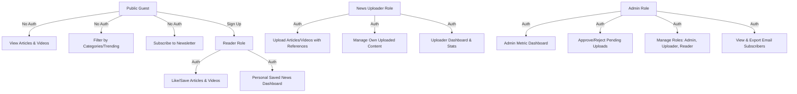

# Implementation Plan: World News Center Hub

Create a premium, modern, and highly-scalable news hub site ("World News Center") where users can read news, watch videos, filter by categories (sports, music, entertainment, politics, tech, etc.), subscribe to email notifications, and sign up to track liked articles/videos. The platform will support role-based access control (RBAC) with **Admin**, **News Uploader**, and **Reader** roles, complete with dashboards and content moderation metrics.

---

## Technical Stack & Scaling

1. **Framework**: **Next.js 14/15 (App Router)** with **TypeScript**.
   - Built-in Server-Side Rendering (SSR) for blazing-fast initial load times and top-tier SEO (using Next.js Metadata API).
   - Server Actions for secure and lightweight form handling/mutations without bloating the client bundle.
2. **Styling**: **Vanilla CSS Modules** and a global theme architecture.
   - Elegant dark/light theme systems utilizing custom CSS variables.
   - Glassmorphism, smooth animations, customized grid layouts, and high-fidelity micro-interactions for a premium, custom-crafted feel.
3. **Database**: **PostgreSQL (Neon)** with **Prisma ORM**.
   - Neon provides autoscaling, serverless connectivity, and branching.
   - Relational model enforces integrity across Users, Roles, News Articles, Likes, and Newsletter Subscribers.
   - Database-level indexes on categories, trending flags, and publication dates for high performance.
4. **Authentication**: **JWT-based secure HttpOnly Cookies**.
   - Secure and stateless session management with Zero third-party dependency bottlenecks.
   - Middleware-based route protection and RBAC verification.
5. **Email System**: Abstracted email delivery service (supports SMTP, Resend, or SendGrid integration) for newsletters and admin notifications.

---

## User Roles & Capabilities



1. **Public Guest (No Authentication Required)**:
   - **Homepage Hub**: Rich header, featured trending carousel, grid list of latest news and video uploads.
   - **Filters**: Quickly filter articles by Latest, Trending, Videos, or Genres (Sports, Music, Entertainment, Tech, Science, Politics).
   - **Video Watcher**: A beautiful integrated inline custom video player for watching news clips.
   - **Newsletter Subscription**: Subscribe using an email address to receive immediate or periodic notifications.
2. **Reader (Authenticated)**:
   - All Guest capabilities.
   - **Like/Save News**: Bookmark and like articles/videos to compile a personalized collection of favorite news.
   - **Personal Dashboard**: Track and manage liked/watched history.
3. **News Uploader (Authenticated)**:
   - All Reader capabilities.
   - **Uploader Panel**: Add, edit, or delete news articles/videos.
   - **Upload Fields**: Title, Summary, Body text (Markdown/HTML), Category, Thumbnail URL, Video URL (optional, supporting YouTube/Vimeo embeds or direct mp4 links), Source reference link (required where necessary), Publish status (Draft or Pending Approval).
4. **Admin (Authenticated)**:
   - **Dashboard Metrics**:
     - *Total Users* (broken down by Reader, Uploader, Admin).
     - *Total Articles* (Total, Published, Pending Approval).
     - *Total Newsletter Subscribers*.
     - *Total Interactive Metrics* (Likes, Article views).
   - **Content Moderation**: Review pending uploads from Uploaders. Approve or Reject with feedback. Mark articles as "Trending" or "Featured".
   - **User Management**: Modify user roles, lock/deactivate accounts.
   - **Subscriber Management**: View and manage the newsletter subscriber list.

---

## Database Architecture (Prisma Schema)

```prisma
datasource db {
  provider = "postgresql"
  url      = env("DATABASE_URL")
}

generator client {
  provider = "prisma-client-js"
}

enum Role {
  READER
  UPLOADER
  ADMIN
}

enum Category {
  SPORTS
  MUSIC
  ENTERTAINMENT
  TECH
  POLITICS
  WORLD
  BUSINESS
}

enum ArticleStatus {
  DRAFT
  PENDING
  APPROVED
  REJECTED
}

model User {
  id           String        @id @default(uuid())
  email        String        @unique
  passwordHash String
  name         String
  role         Role          @default(READER)
  createdAt    DateTime      @default(now())
  updatedAt    DateTime      @updatedAt
  articles     Article[]     // Uploaded articles (if role is UPLOADER or ADMIN)
  likes        Like[]
}

model Article {
  id          String        @id @default(uuid())
  title       String
  slug        String        @unique
  summary     String
  content     String        @db.Text
  category    Category
  imageUrl    String?       // Featured cover image
  videoUrl    String?       // Video link (if video news type)
  sourceUrl   String?       // External reference source link
  status      ArticleStatus @default(PENDING)
  isTrending  Boolean       @default(false)
  isFeatured  Boolean       @default(false)
  views       Int           @default(0)
  uploaderId  String
  uploader    User          @relation(fields: [uploaderId], references: [id], onDelete: Cascade)
  createdAt   DateTime      @default(now())
  updatedAt   DateTime      @updatedAt
  likes       Like[]

  @@index([status, createdAt])
  @@index([isTrending, isFeatured])
  @@index([category])
}

model Like {
  id        String   @id @default(uuid())
  userId    String
  user      User     @relation(fields: [userId], references: [id], onDelete: Cascade)
  articleId String
  article   Article  @relation(fields: [articleId], references: [id], onDelete: Cascade)
  createdAt DateTime @default(now())

  @@unique([userId, articleId]) // Prevents double-liking
}

model Subscriber {
  id        String   @id @default(uuid())
  email     String   @unique
  active    Boolean  @default(true)
  createdAt DateTime @default(now())
}
```

---

## Core Component Structure (Design System)

We will construct a fully responsive, highly customized CSS library using CSS variables inside a global `/styles/variables.css` and use specific component styling modules (e.g. `Header.module.css`, `Dashboard.module.css`).

- `/styles/variables.css`: Defines HSL-based premium colors, gradients, font metrics (Inter & Outfit fonts via Next.js Google Fonts), glassmorphic values, and dark mode overrides.
- **Glassmorphism Nav**: A modern, translucent navigation bar with interactive micro-animations.
- **Unified Card Grid**: Adaptive cards displaying articles/videos with hovering scale effects, category badges, dynamic reading times, and interactive direct likes.
- **Custom HTML5/Embed Video Player**: Elegant, responsive container supporting native controls overlaid with theme accents.
- **Admin Dashboard UI**: Metric summaries utilizing SVG charts and grids, action drawers for article approvals, and a clean tabular directory of users.

---

## Verification Plan

### Automated Testing & Linting
- **Compilation & Build**: `npm run build` to verify production bundles, Server Actions type-safety, and route optimization.
- **Database Schema Sync**: Verify migrations apply seamlessly to a local or development PostgreSQL instance.
- **ESLint Compliance**: Ensure code linting matches strict Next.js configurations.

### Manual Verification Flow
1. **Unauthenticated User Experience**:
   - Access the homepage, verify categories (Sports, Music, Entertainment, etc.) filters.
   - Click and read/watch news articles and videos. Ensure custom player is responsive.
   - Enter email into subscription field and verify successful API response.
2. **Authenticated Reader Experience**:
   - Sign up and sign in.
   - Like an article; verify the "like" is added instantly and visible in the personal reader dashboard.
   - Log out and verify permissions revoke immediately.
3. **Uploader Experience**:
   - Register/login as an uploader (roles will be switchable in development via a dev tool or easily configured on initial signup or by Admin).
   - Create a news draft. Submit for moderation. Upload with valid sources and image/video links.
   - Confirm it goes into "PENDING" and does not display on the public homepage.
4. **Admin Experience**:
   - Log in as Admin. Access `/admin/dashboard`.
   - Verify metrics increase when new articles or users are registered.
   - Go to "Moderation" and approve the pending article. Verify it now renders on the public homepage.
   - Toggle "Trending" on an article and observe carousel updates.
   - Toggle user roles and check restriction boundaries.
